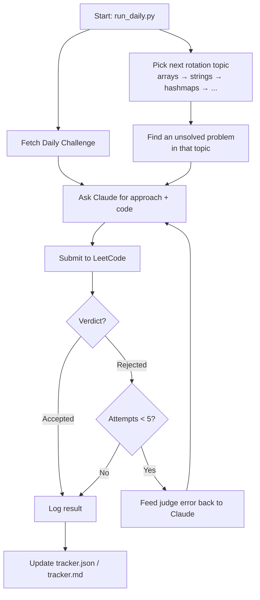

> **⚠️ ToS warning:** this project scripts real submissions against LeetCode's
> unofficial, reverse-engineered internal API. That's against LeetCode's
> Terms of Service. Use a **throwaway account only** — never your main
> practice account.

# Daily LeetCode Auto-Solver Agent

An autonomous agent that, once a day, fetches LeetCode's Daily Challenge plus
one problem from a rotating topic list, generates a Python solution via the
Claude Code CLI, submits it to LeetCode, and self-corrects (regenerate +
resubmit, feeding back the judge's failure detail) up to 5 times before
giving up. Everything is logged and tracked (streak, success rate, average
attempts-to-accept).

## How one daily run works



## Project structure

```
run_daily.py         entrypoint — ties everything together, retry loop, logging
├── leetcode_client.py   talks to LeetCode: fetch problems, submit, poll verdict
├── solver.py             talks to Claude: build prompt, parse approach + code
└── tracker.py             reads/writes tracker.json, renders tracker.md

run_daily.bat         Task Scheduler wrapper (cd's into this folder, then runs run_daily.py)
.env.example          template for your LeetCode auth values
README.md             this file

# created automatically once you run it:
logs/YYYY-MM-DD.json  full detail of every attempt for that day
tracker.json           raw scoreboard data
tracker.md              human-readable scoreboard
```

You only ever run `run_daily.py` (or `run_daily.bat` for the scheduled
version) directly — it calls into the other three files for you.

## Prerequisites

- Python 3.11+
- `claude` CLI installed and authenticated (run `claude --help` to confirm)
- A throwaway LeetCode account

## Setup

1. Log into the throwaway account in a browser. Open devtools → Application →
   Cookies → `leetcode.com`, and copy the `LEETCODE_SESSION` and `csrftoken`
   values.
2. For scheduled runs, persist them as user environment variables (Task
   Scheduler reads the persisted environment, not your current shell's):
   ```
   setx LEETCODE_SESSION "<value>"
   setx LEETCODE_CSRF_TOKEN "<csrftoken value>"
   ```
   (open a new terminal to see them locally — the scheduled task picks them
   up automatically.)
3. For manual/local runs, instead copy `.env.example` to `.env` and fill in
   the same two values. **Never commit `.env`** — it's already in
   `.gitignore`.

## Run manually

```
python run_daily.py
python run_daily.py --dry-run   # generates approach + code, skips submitting
```

## Register the daily schedule

`run_daily.bat` changes into the script's own directory before running
(`schtasks`'s simple `/tr` form has no working-directory flag, so without
this the scheduled run's relative paths would resolve against
`C:\Windows\System32`):

```bat
@echo off
cd /d "%~dp0"
python run_daily.py
```

Register it to run daily at 7am:

```
schtasks /create /tn "LeetCodeDailyAgent" /tr "\"C:\path\to\leetcode agent\run_daily.bat\"" /sc daily /st 07:00 /f
```

Verify and test-fire:

```
schtasks /query /tn "LeetCodeDailyAgent" /v /fo LIST
schtasks /run /tn "LeetCodeDailyAgent"
```

## Outputs

- `logs/YYYY-MM-DD.json` — full per-attempt approach/code/verdict detail
- `tracker.json` — streak, rotation position, solved slugs, run history
- `tracker.md` — human-readable summary (streak, success rate, avg
  attempts-to-accept, per-topic counts, recent runs table)

---

> **⚠️ Reminder:** real submissions, against ToS, throwaway account only.
